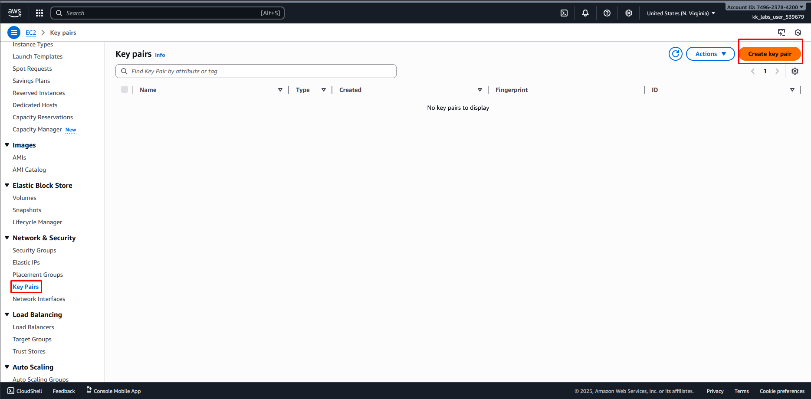
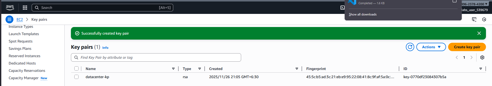

### Steps to create key pair via AWS Console:

Login to AWS Console:

Go to: https://749623784200.signin.aws.amazon.com/console?region=us-east-1

Username: kk_labs_user_539679

Password: 46NJ5xgPLI9e

Navigate to EC2 Service:

Once logged in, type "EC2" in the search bar at the top

Click on "EC2" from the search results

Create Key Pair:

In the left sidebar, scroll down to find "Network & Security" section

Click on "Key Pairs"

Click the orange "Create key pair" button at the top right

Configure Key Pair:

Name: Enter datacenter-kp

Key pair type: Select RSA

Private key file format: You can choose either:

.pem (for use with OpenSSH)

.ppk (for use with PuTTY on Windows)

Click "Create key pair"

Download the Key:

The private key file will automatically download to your computer

IMPORTANT: Save this file securely as it cannot be retrieved again

You'll use this key to connect to EC2 instances later

---

### **Resources & Next Steps**

*   **📦 Full Code Repository:** [KodeKloud Learning Labs](https://github.com/thukhakyawe/100-Days-Of-Cloud-AWS-KodeKloud-Challenges-Solutions)
*   **📖 More Deep Dives:** [Whispering Cloud Insights](https://thukhakyawe.hashnode.dev/) - Read other technical articles
*   **💬 Join Discussion:** [DEV Community](https://dev.to/thukhakyawe_cloud) - Share your thoughts and questions
*   **💼 Let's Connect:** [Linkedin](www.linkedin.com/in/thukhakyawe/) - I'd love to connect with you

---