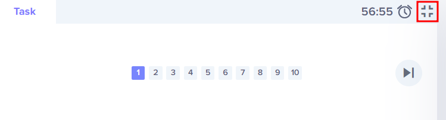

The Nautilus DevOps team is strategizing the migration of a portion of their infrastructure to the AWS cloud. Recognizing the scale of this undertaking, they have opted to approach the migration in incremental steps rather than as a single massive transition. To achieve this, they have segmented large tasks into smaller, more manageable units. This granular approach enables the team to execute the migration in gradual phases, ensuring smoother implementation and minimizing disruption to ongoing operations. By breaking down the migration into smaller tasks, the Nautilus DevOps team can systematically progress through each stage, allowing for better control, risk mitigation, and optimization of resources throughout the migration process.

For this task, create a key pair with the following requirements:

Name of the key pair should be datacenter-kp.

Key pair type must be rsa

Use below given AWS Credentials: (You can run the showcreds command on aws-client host to retrieve these credentials)
Console URL 	https://749623784200.signin.aws.amazon.com/console?region=us-east-1
Username 	kk_labs_user_539679
Password 	46NJ5xgPLI9e
Start Time 	Wed Nov 26 14:24:41 UTC 2025
End Time 	Wed Nov 26 15:24:41 UTC 2025

Notes:

    Create the resources only in us-east-1 region.

    To display or hide the terminal of the AWS client machine, you can use the expand toggle button as shown below:
    toggle button

