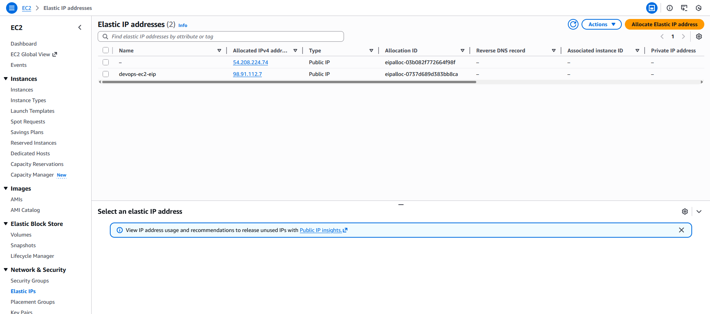
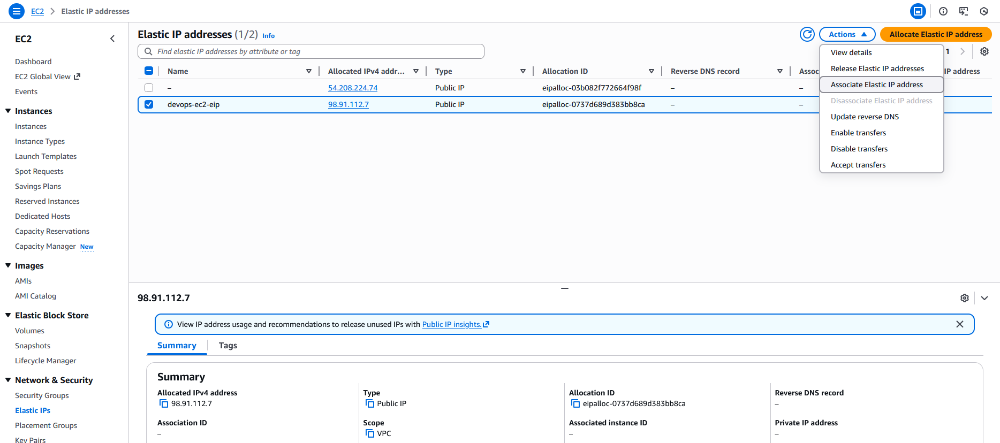
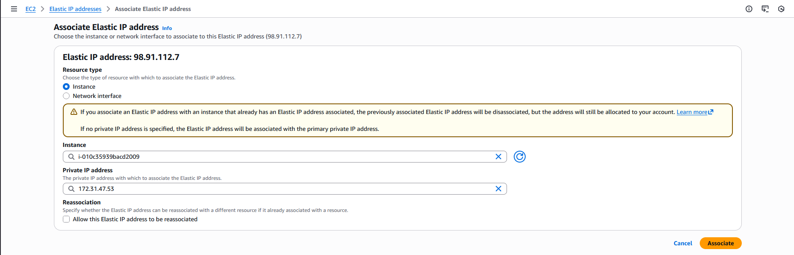

### Step-by-Step Instructions (AWS Console)
1. Log in

Use the provided console URL and credentials.
Ensure region = us-east-1.

2. Identify the Elastic IP

Open AWS console → search EC2 → open it.

In the left menu, navigate to Network & Security → Elastic IPs.

Locate the Elastic IP with Name = devops-ec2-eip.

Note the Allocation ID (you do not need it, but AWS will use it internally).

3. Associate the Elastic IP

Select the row for devops-ec2-eip.

Click Actions.

Select Associate Elastic IP address.

A configuration window will appear.

4. Choose the Instance to Attach

Under “Resource type”:

Choose Instance

Then select:

Instance: devops-ec2

Private IP: (choose the default one shown, usually something like 172.31.x.x)

Then click Associate.

AWS will bind the Elastic IP to the selected instance.

---