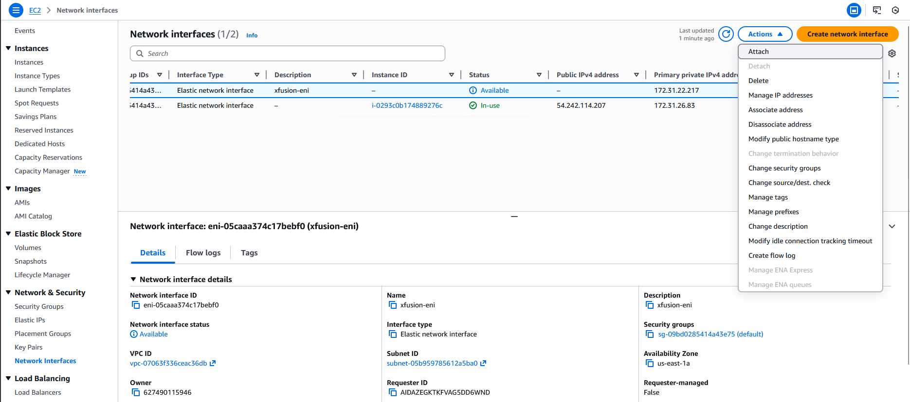
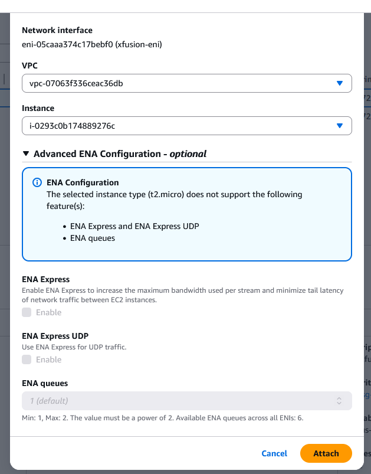
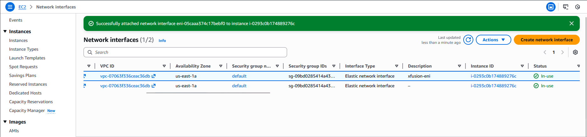
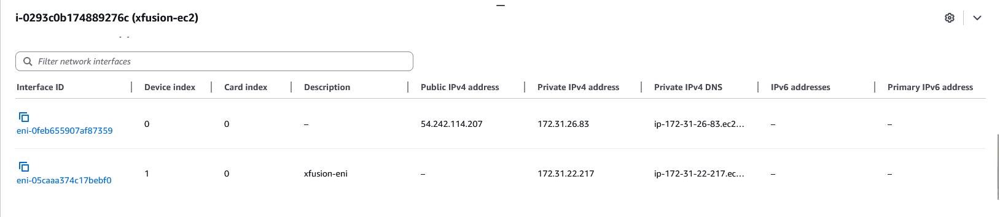

#### Step-by-Step Instructions (AWS Console)
1. Log in

Use your console link and credentials.
Confirm region = us-east-1.

2. Verify EC2 Instance Status

Before attaching ENI, ensure xfusion-ec2 is initialized.

Go to EC2 → Instances

Select xfusion-ec2

Confirm:

Instance state: Running

Status checks: 2/2 checks passed (NOT “Initializing”)

If still initializing → wait until completed.

3. Locate the Network Interface

In the EC2 left menu → click Network Interfaces (under Network & Security)

Find the ENI named xfusion-eni

Select it

Make sure the ENI is available (status: "available").
If it is already attached, no action is needed.

4. Attach the ENI

With xfusion-eni selected:

Click Actions

Click Attach network interface

In the dialog:

Instance: Select xfusion-ec2

Device index: leave default (usually 1)
(Device index 0 is the primary interface; secondary ENIs use index ≥1)

Click Attach

5. Verify Attachment

After attaching:

ENI status should display: in-use

Under Attachment, you should see:

Status: attached

Instance ID: the ID of xfusion-ec2

On the xfusion-ec2 instance details page → Network interfaces section should list both:

Primary ENI (eth0)

xfusion-eni (eth1 or next index)

---