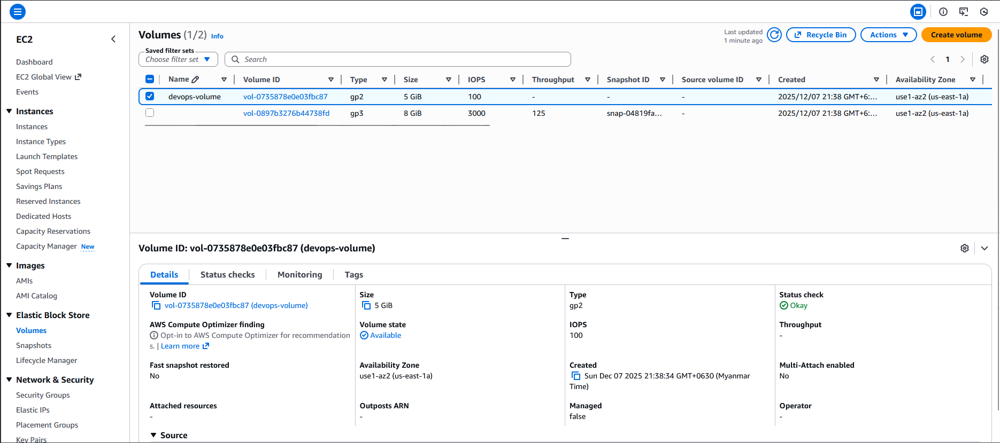
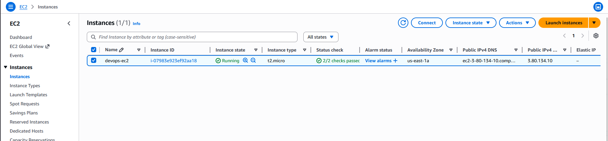
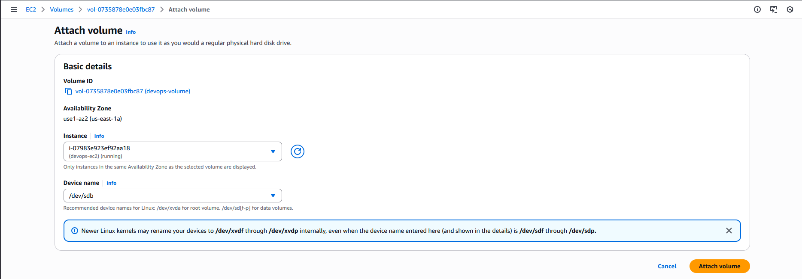
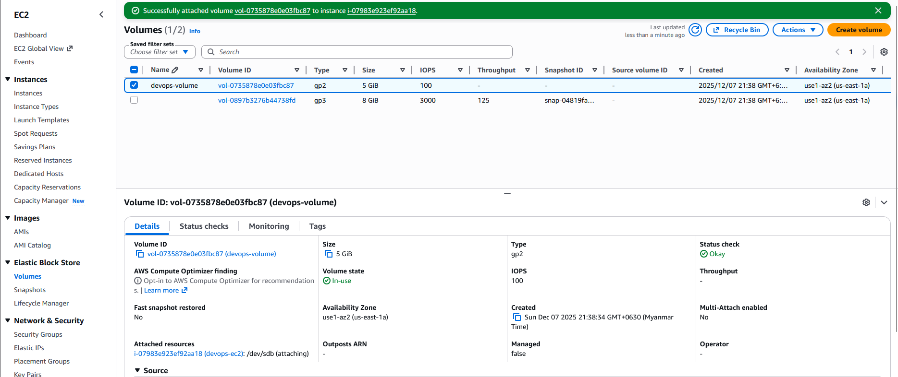
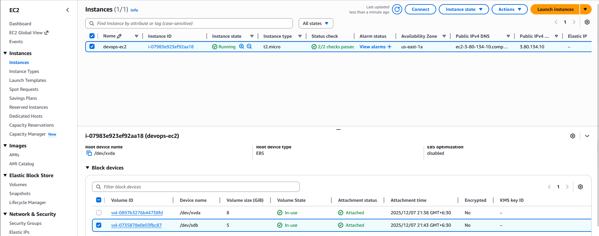

#### Step-by-Step Instructions (AWS Console)
1. Log in

Use the provided console URL and credentials.
Confirm region = us-east-1.

2. Check Volume Availability

Open the EC2 service.

In the left panel → click Volumes (under “Elastic Block Store”).

Find devops-volume.

Ensure its state = available.

Also verify the Availability Zone (AZ).
Important: The EC2 instance must be in the same AZ as the volume.

3. Check the Instance

Go to Instances

Locate devops-ec2

Ensure it is in the same Availability Zone as the volume.

Instance can be running — attaching works for both stopped and running states.

4. Attach the Volume

Go back to Volumes

Select devops-volume

Click Actions → Attach volume

In the popup:

Instance: Choose devops-ec2

Device name: Enter /dev/sdb

Click Attach volume

5. Verify Attachment

After attaching:

Volume state should change to in-use

Under Attachment information, it should show:

Instance ID: (devops-ec2)

Device: /dev/sdb

On the EC2 devops-ec2 instance page:

Open Storage tab

You should now see an additional block device listed as /dev/sdb

---