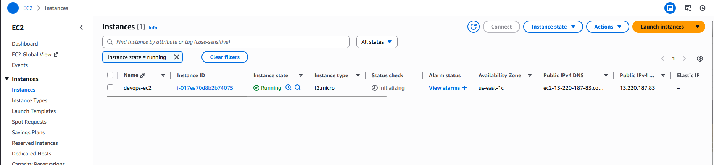
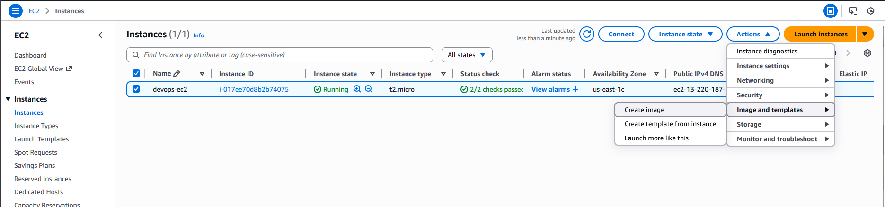
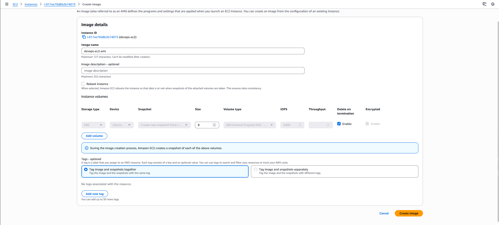
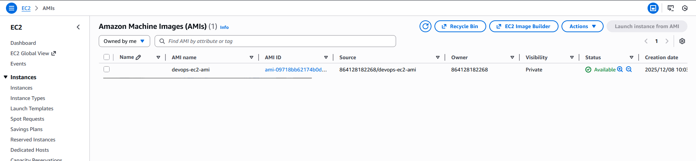

####  Step-by-Step Instructions (AWS Console)
1. Log in to AWS Console

Use your lab credentials and ensure the region is us-east-1.

2. Navigate to the EC2 Instance

Go to EC2 service

Click Instances

Find and select the instance named devops-ec2

Ensure:

It is in running state (recommended)

3. Create the AMI

With devops-ec2 selected:

Click Actions

Select Image and templates

Click Create image

A form will appear.

Fill in the required details:

Image name: devops-ec2-ami

Image description: (optional)

No reboot:

Default (reboot allowed) is safer and recommended.

Click Create image

AWS will now start generating the AMI.

4. Verify AMI Creation

Go to Images → AMIs in the left EC2 menu.

Ensure Owned by me is selected.

Find AMI named devops-ec2-ami

Initially, the State will show:

pending

Wait until it becomes:

available

This may take a few minutes depending on instance size.

