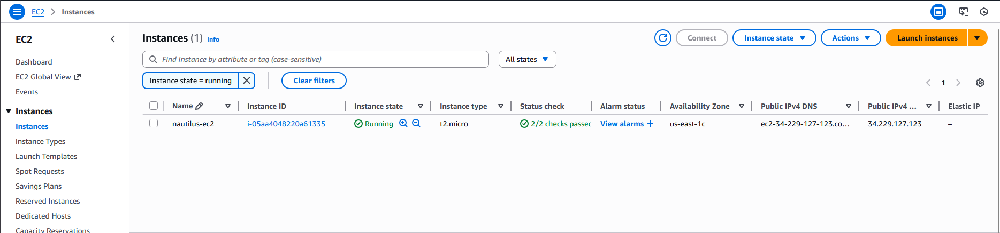
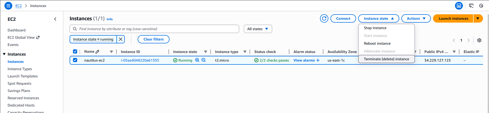
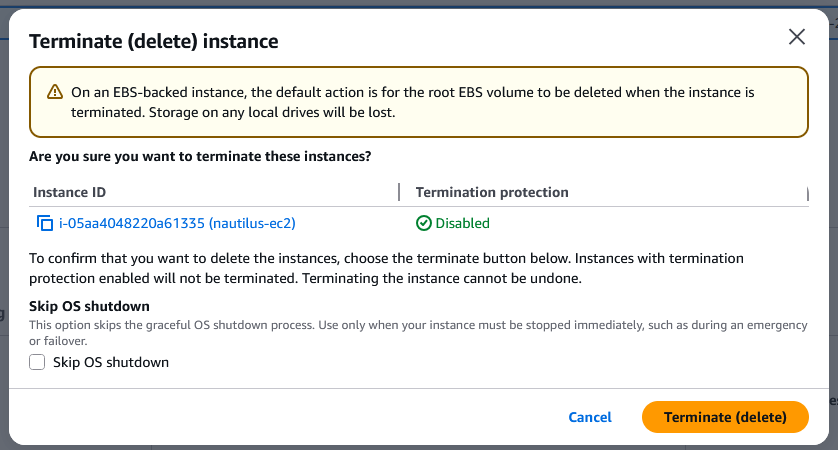

#### Step-by-Step Instructions (AWS Console)
1. Log in

Use your lab credentials and ensure the region is us-east-1.

2. Locate the Instance

Open EC2 service.

Click Instances in the left menu.

Find the instance named nautilus-ec2.

3. Check Termination Protection

To check:

Select nautilus-ec2

In the lower panel → Details

Look for: Termination protection: Enabled?

If enabled:

Click Actions → Instance settings → Change termination protection

Uncheck Enable termination protection

Save

4. Terminate the Instance

Select the instance nautilus-ec2

Click Instance state → Terminate instance

Confirm termination

AWS will now shut down and delete the instance.

5. Verify the Instance Reaches TERMINATED State

After a few seconds to minutes:

State changes:
running → stopping → stopped → shutting-down → terminated

Make sure the final state = terminated before submitting.

Refresh the page if needed.

