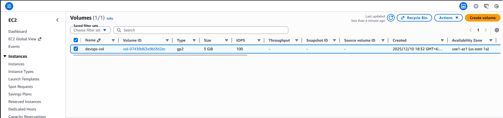
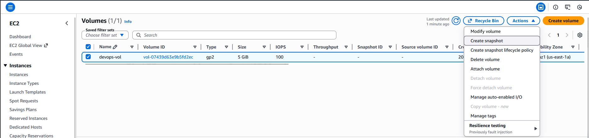
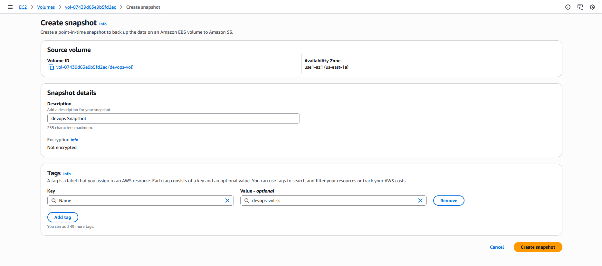
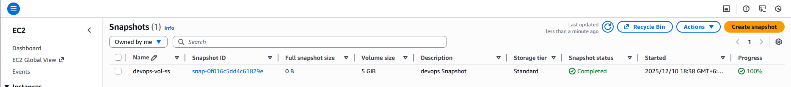

#### Step-by-Step Instructions (AWS Console)
1. Log in

Use your provided console URL and credentials.
Ensure region is us-east-1.

2. Find the Volume

Open the EC2 service.

In the left navigation menu → under Elastic Block Store, click Volumes.

Locate the volume named devops-vol.

Confirm:

State: available or in-use (snapshot can be created in either state)

Type: doesn’t matter for snapshot creation

3. Create the Snapshot

Select the volume devops-vol.

Click Actions → Create snapshot.

Fill in:

Description: devops Snapshot

Tag

Name: devops-vol-ss

Everything else can be left at default.

Click Create snapshot.

AWS now begins creating the snapshot.

4. Verify Snapshot Creation

In the left menu → click Snapshots.

Ensure Owned by me is selected.

Locate snapshot devops-vol-ss.

The Status will initially be:

pending

Wait until it becomes:

completed

Refresh the page if necessary.

---