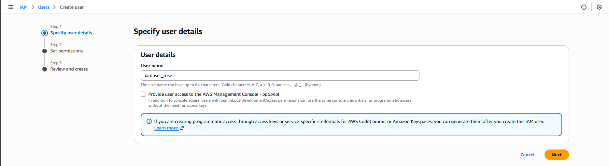
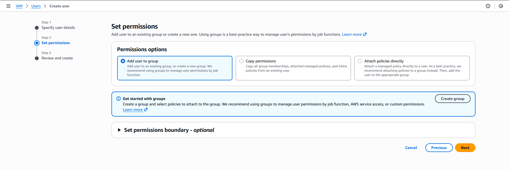
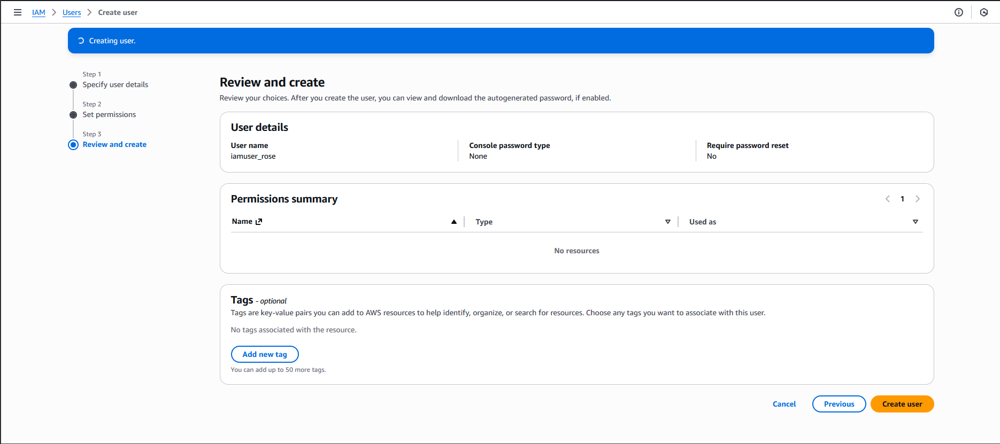

#### Step-by-Step Instructions (AWS Console)
1. Log in to AWS Console

Use your provided console URL and credentials.

2. Open IAM Service

In the AWS Console search bar → type IAM

Click IAM to open the Identity and Access Management dashboard.

3. Create the IAM User

On the left menu → click Users

Click Create user

In the User name field → enter:

iamuser_rose

Click Next

Click Create user 

---