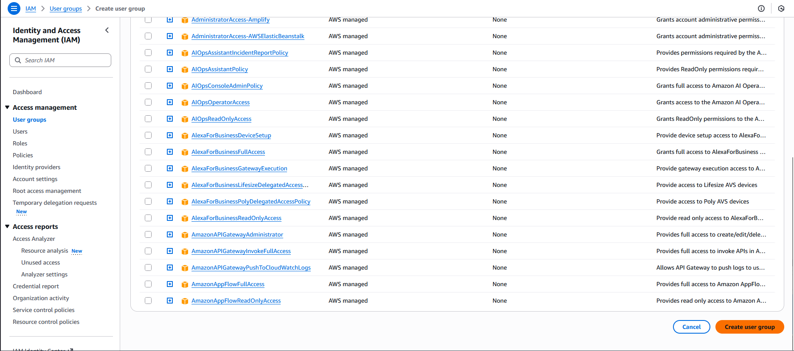

#### Step-by-Step Instructions (AWS Console)
1. Log in to AWS Console

Use your provided console URL and credentials.

2. Open the IAM Service

In the AWS search bar → type IAM

Click IAM to open the dashboard.

3. Create the IAM Group

In the left navigation pane → click User groups

Click Create group

Under User group name, enter:

`iamgroup_james`

You do NOT need to add users or policies unless the lab specifically asks for it.

Scroll down and click Create group

---