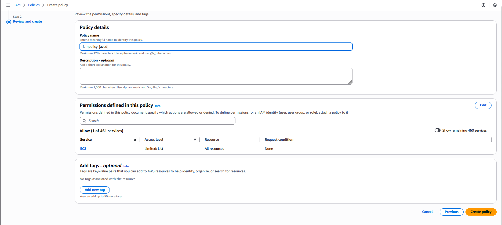

#### Step-by-Step Instructions (AWS Console)

1. Log in to AWS Console

Use your lab credentials and ensure the console region is us-east-1.

2. Open IAM Service

In the AWS search bar → type IAM

Click IAM

3. Create the IAM Policy

In the left menu → click Policies

Click Create policy

4. Define Policy Permissions

You will see Visual editor and JSON tabs.

👉 Switch to the JSON tab

Replace the existing content with the following policy document:

```
{
  "Version": "2012-10-17",
  "Statement": [
    {
      "Effect": "Allow",
      "Action": [
        "ec2:DescribeInstances",
        "ec2:DescribeImages",
        "ec2:DescribeSnapshots",
        "ec2:DescribeVolumes",
        "ec2:DescribeTags"
      ],
      "Resource": "*"
    }
  ]
}
```

This grants read-only (describe) access to:

EC2 instances

AMIs

Snapshots

Related metadata

Click Next.

5. Name the Policy

On the Review and create page:

Policy name: `iampolicy_javed`

Description (optional):

Read-only access to EC2 instances, AMIs, and snapshots


Click Create policy.



---