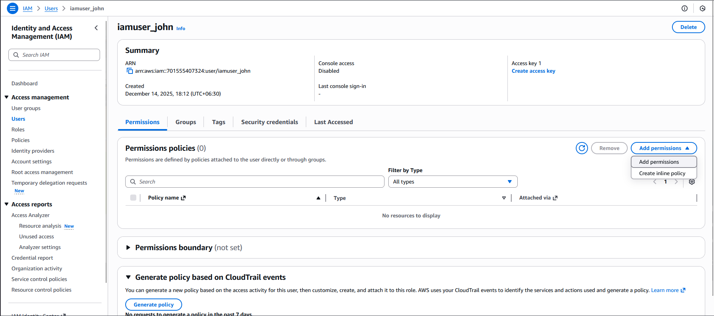
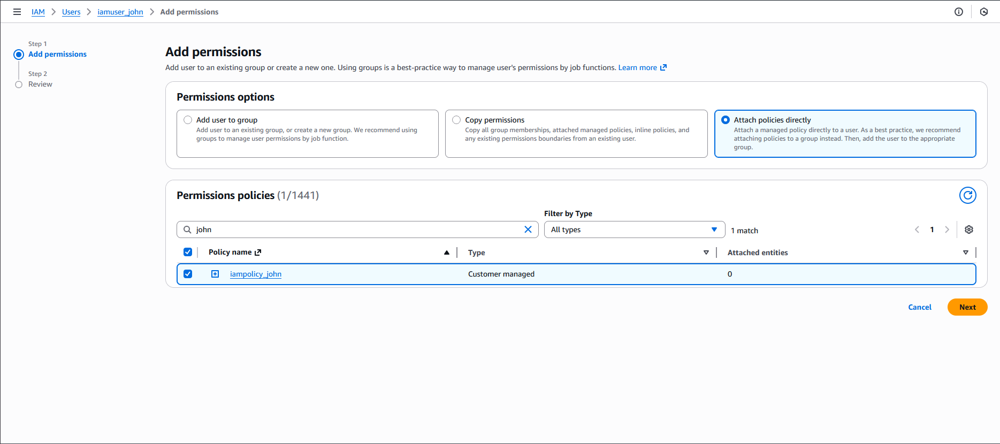
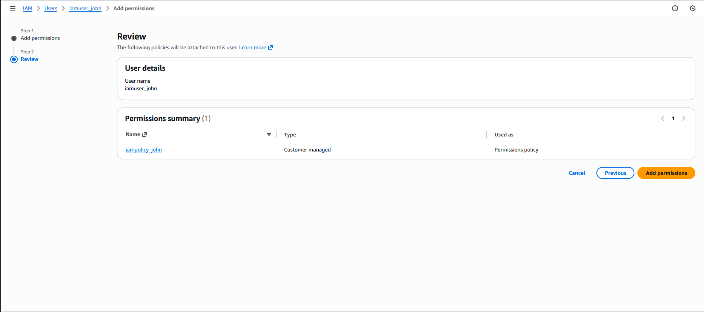

#### Step-by-Step Instructions (AWS Console)
1. Log in to AWS Console

Use your lab credentials.

2. Open IAM Service

In the AWS search bar → type IAM

Click IAM

3. Locate the IAM User

In the left navigation pane → click Users

Click on the user iamuser_john

4. Attach the Policy

Open the Permissions tab

Click Add permissions

Click Add permissions

Select Attach policies directly

In the policy list, search for:

`iampolicy_john`

Check the box next to iampolicy_john

Click Next

Click Add permissions

---