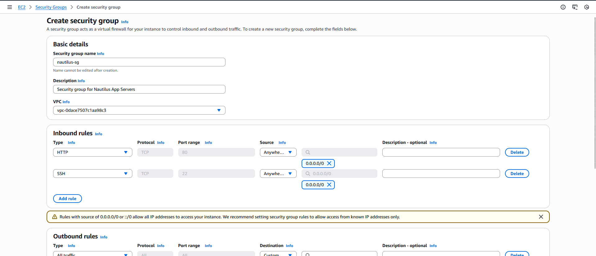

#### Steps to Create Security Group via AWS Console:

Login to AWS Console:

Go to: https://415282657320.signin.aws.amazon.com/console?region=us-east-1

Username: `kk_labs_user_173003`

Password: `YDAp^9u0@kA9`

Navigate to VPC Service:

Once logged in, type "VPC" in the search bar at the top

Click on "VPC" from the search results

Create Security Group:

In the left sidebar, scroll down to the "Security" section

Click on "Security Groups"

Click the orange "Create security group" button at the top right

Configure Basic Details:

Security group name: Enter nautilus-sg

Description: Enter Security group for Nautilus App Servers

VPC: Make sure it's set to the default VPC (it should be selected by default)

Add Inbound Rules:

First Rule - HTTP:

Click "Add rule"

Type: Select HTTP

Port range: Should auto-fill to 80

Source: Select Custom and enter 0.0.0.0/0

Second Rule - SSH:

Click "Add rule" again

Type: Select SSH

Port range: Should auto-fill to 22

Source: Select Custom and enter 0.0.0.0/0

Create Security Group:

Scroll down and click the orange "Create security group" button

---
