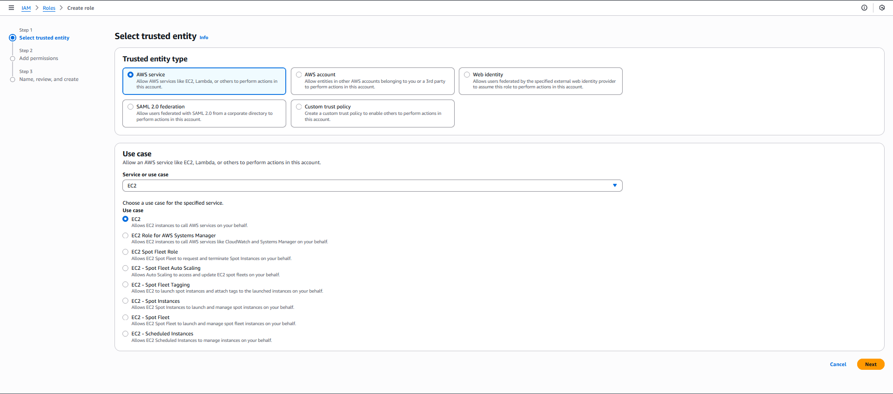
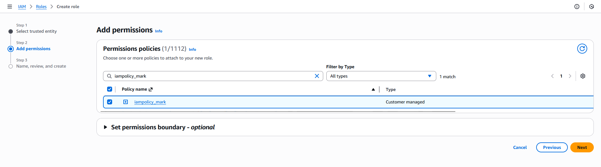
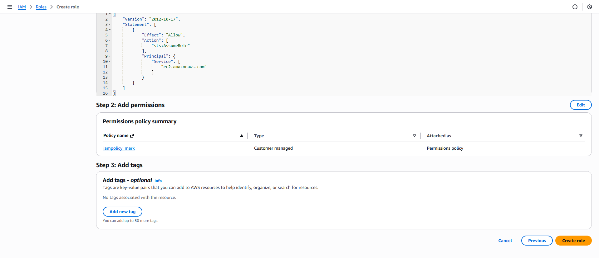

#### Step-by-Step Instructions (AWS Console)
1. Log in to AWS Console

Use your lab credentials.

2. Open IAM Service

In the AWS search bar → type IAM

Click IAM

3. Create the IAM Role

In the left navigation pane → click Roles

Click Create role

4. Select Trusted Entity

On the Select trusted entity page:

Trusted entity type: AWS service

Use case: EC2

Click Next.

5. Attach Permissions Policy

In the permissions list, search for:

`iampolicy_mark`

Select the policy iampolicy_mark

Click Next

6. Name the Role

On the Name, review, and create page:

Role name: `iamrole_mark`

(Optional) Description:

IAM role for EC2 with iampolicy_mark attached

Click Create role.

---

