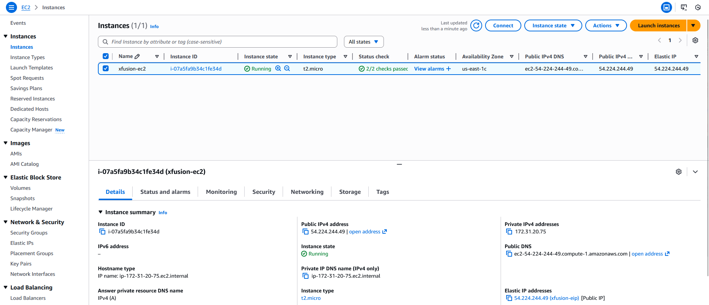

#### Step-by-Step Instructions (AWS Console)
1. Log in to AWS Console

Use your lab credentials and confirm the region is us-east-1 (N. Virginia).

2. Launch the EC2 Instance
2.1 Open EC2

Search for EC2 → click Launch instance

2.2 Name the Instance

Under Name and tags:

Name: xfusion-ec2

2.3 Choose Linux AMI

Under Application and OS Images (AMI), select any Linux AMI, for example:

Ubuntu Server 20.04 LTS or Ubuntu Server 22.04 LTS

2.4 Choose Instance Type

Select t2.micro

2.5 Key Pair

Choose an existing key pair or create a new one (lab usually allows either)

2.6 Network Settings

Use default VPC

Use default security group

Ensure Auto-assign public IP is Enabled (EIP will replace it later)

2.7 Launch

Click Launch instance
Wait until the instance state becomes Running and status checks pass (2/2).

3. Allocate an Elastic IP
3.1 Navigate to Elastic IPs

EC2 → Network & Security → Elastic IPs

3.2 Allocate Elastic IP

Click Allocate Elastic IP address

Leave defaults

Click Allocate

3.3 Name the Elastic IP

Select the newly created Elastic IP

Go to Tags → Manage tags

Add:

Key: Name

Value: xfusion-eip

Save

4. Associate Elastic IP with EC2 Instance

Select xfusion-eip

Click Actions → Associate Elastic IP address

Set:

Resource type: Instance

Instance: xfusion-ec2

Private IP: Default

Click Associate

5. Verify Configuration
EC2 Instance

Public IPv4 address = Elastic IP

Instance name = xfusion-ec2

State = Running

Elastic IP

Name = xfusion-eip

Status = Associated

Instance = xfusion-ec2

---