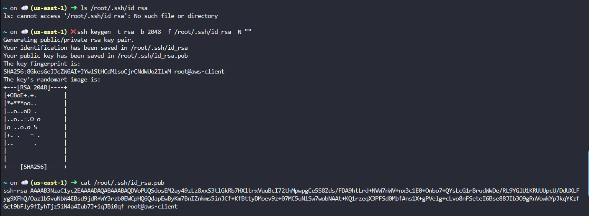

#### Step-by-Step Solution
STEP 1: Create the EC2 Instance (AWS Console)

Log in to AWS Console (region us-east-1)

Go to EC2 → Launch instance

Configure:

Name: devops-ec2

AMI: Amazon Linux 2 (or Ubuntu)

Instance type: t2.micro

Key pair: You may select any (not important for this lab)

Security group:

Allow SSH (port 22)

Source: aws-client IP or 0.0.0.0/0 (lab safe)

Launch the instance

Wait until:

State: Running

Status checks: 2/2 passed

STEP 2: Generate SSH Key on aws-client Host

Type these commands in labs
```
whoami
hostname
```


Check if SSH key already exists:
```
ls /root/.ssh/id_rsa
```

If it does not exist, create it:
```
ssh-keygen -t rsa -b 2048 -f /root/.ssh/id_rsa -N ""
```

What this does

-t rsa → RSA key (lab requirement)

-b 2048 → key length

-f /root/.ssh/id_rsa → correct location

-N "" → no passphrase (required for passwordless SSH)

This creates:

Private key: /root/.ssh/id_rsa

Public key: /root/.ssh/id_rsa.pub

STEP 3: Copy Public Key Content

Display the public key:

```
cat /root/.ssh/id_rsa.pub
```



Copy the entire output (starts with ssh-rsa).

STEP 4: Add Public Key to EC2 Instance
4.1 Connect to EC2 instance (using console or existing key)

From AWS Console:

EC2 → devops-ec2

Use EC2 Instance Connect or existing SSH method

4.2 Add Key to root authorized_keys

On the EC2 instance:
```
sudo mkdir -p /root/.ssh
sudo vi /root/.ssh/authorized_keys
```

Paste the copied public key on a new line, then save.

Fix permissions:
```
sudo chmod 700 /root/.ssh
sudo chmod 600 /root/.ssh/authorized_keys
sudo chown -R root:root /root/.ssh
```

STEP 5: Test Passwordless SSH from aws-client

From aws-client host:

ssh -i /root/.ssh/id_rsa root@ec2-54-160-142-136.compute-1.amazonaws.com


---