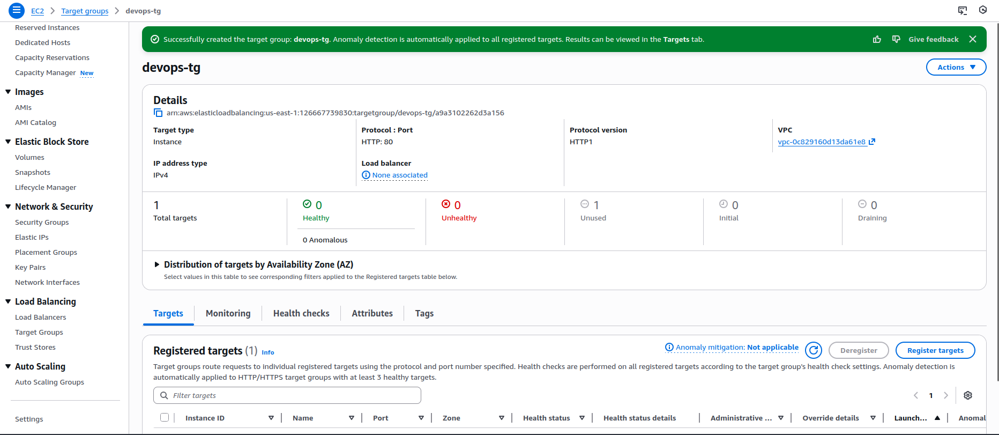
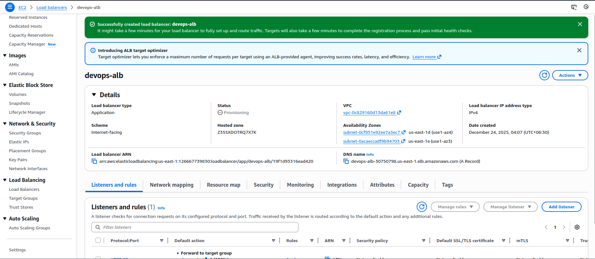
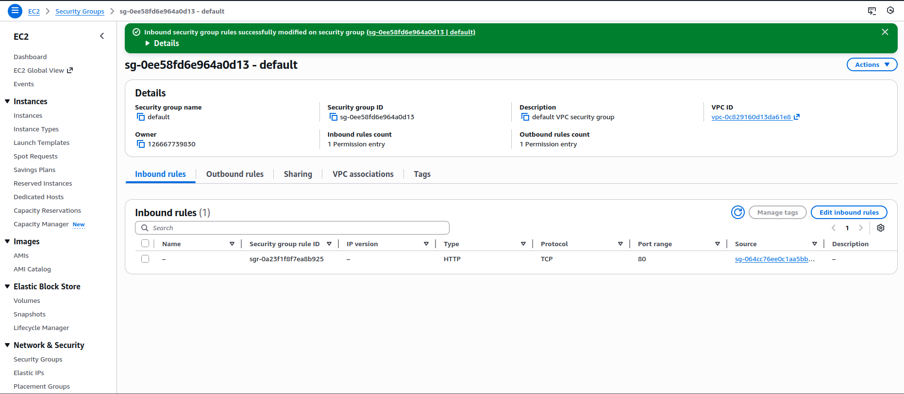
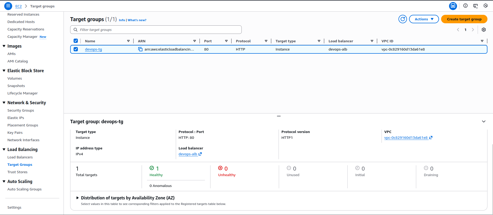
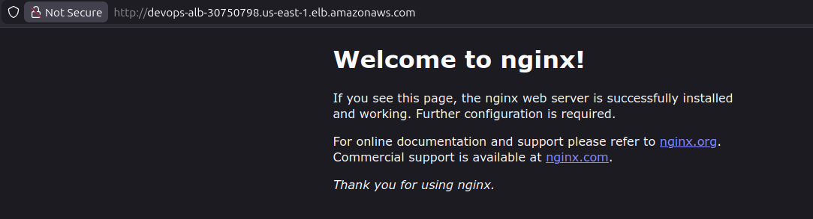

🧭 Step-by-Step Solution
🔹 STEP 1: Create Security Group for ALB (devops-sg)

Go to EC2 → Security Groups

Click Create security group

Set:

Security group name: devops-sg

Description: ALB security group

VPC: Default VPC

Inbound rules → Add rule

Type: HTTP

Port: 80

Source: 0.0.0.0/0

Leave Outbound rules as default

Click Create security group

✅ This allows public internet traffic to the ALB.

🔹 STEP 2: Create Target Group (devops-tg)

Go to EC2 → Target Groups

Click Create target group

Configure:

Target type: Instances

Target group name: devops-tg

Protocol: HTTP

Port: 80

VPC: Default VPC

Health checks

Protocol: HTTP

Path: / (default, works with Nginx)

Click Next

Select devops-ec2

Port: 80

Click Include as pending

Click Create target group

🔹 STEP 3: Create Application Load Balancer (devops-alb)

Go to EC2 → Load Balancers

Click Create load balancer

Choose Application Load Balancer

Basic configuration

Name: devops-alb

Scheme: Internet-facing

IP address type: IPv4

Network mapping

VPC: Default VPC

Availability Zones: Select at least 2 subnets

Security groups

Remove default SG

Select devops-sg

Listeners & routing

Listener: HTTP : 80

Forward to: devops-tg

Click Create load balancer

🔹 STEP 4: Update EC2 Security Group (VERY IMPORTANT)

Your EC2 instance must allow traffic from the ALB, otherwise it will fail health checks.

Go to EC2 → Instances

Select devops-ec2

Click its Security Group

Edit inbound rules

Add rule:

Type: HTTP

Port: 80

Source: Security group

Select: devops-sg

❌ Do NOT leave it open to 0.0.0.0/0 unless the lab allows it
✅ Best practice is ALB → EC2 only

Save rules.

🔹 STEP 5: Verify Everything Works
1️⃣ Check Target Group Health

EC2 → Target Groups → devops-tg

Targets should show Healthy

2️⃣ Access the ALB

EC2 → Load Balancers → devops-alb

Copy DNS name, e.g.:

devops-alb-30750798.us-east-1.elb.amazonaws.com

Open in browser:

http://<ALB-DNS>

✅ You should see the Nginx welcome page

---