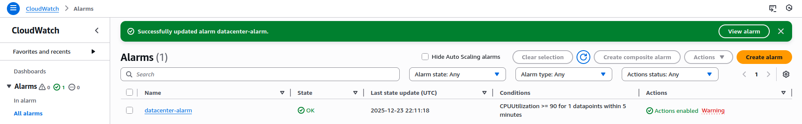

🔹 STEP 1: Launch the EC2 Instance
1️⃣ Open EC2

AWS Console → EC2 → Launch instance

2️⃣ Configure instance

Name: datacenter-ec2

AMI: Ubuntu Server (20.04 LTS or 22.04 LTS)

Instance type: t2.micro (or any allowed type)

Key pair: Select or create one (lab choice)

Network:

Default VPC

Default subnet

Security group:

Allow SSH (port 22)

3️⃣ Launch

Click Launch instance

Wait until:

State: Running

Status checks: 2/2 passed

🔹 STEP 2: Create the CloudWatch Alarm
1️⃣ Open CloudWatch

AWS Console → CloudWatch

Left menu → Alarms

Click Create alarm

2️⃣ Select the Metric

Click Select metric

Navigate:

EC2 → Per-Instance Metrics → CPUUtilization

Select the metric for datacenter-ec2

Click Select metric

3️⃣ Configure Alarm Conditions

Set the following exactly:

Setting	Value
Statistic	Average
Period	5 minutes
Threshold type	Static
Condition	Greater than or equal to
Threshold value	90
Datapoints to alarm	1 out of 1
4️⃣ Configure Alarm Actions

Alarm state trigger: In alarm

Send notification to:

Select Existing SNS topic

Choose datacenter-sns-topic

5️⃣ Name the Alarm

Alarm name: datacenter-alarm

Description (optional):

Alarm when CPU exceeds 90% for 5 minutes

Click Create alarm

🔹 STEP 3: Verify Configuration
✔ CloudWatch Alarm

State initially: OK (normal)

Metric: CPUUtilization

Threshold: ≥ 90%

Period: 5 minutes

✔ SNS Action

Alarm action shows datacenter-sns-topic

---