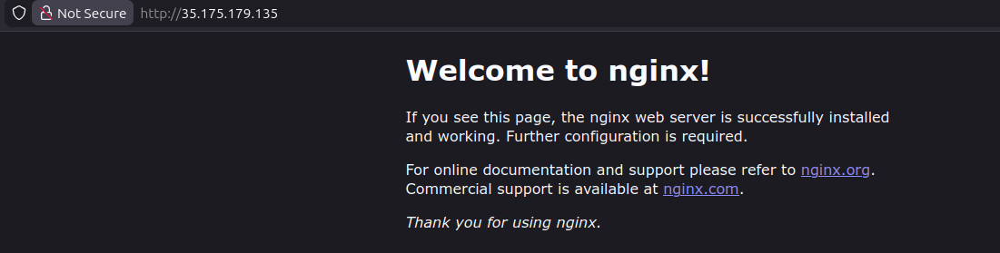

🔹 STEP 1: Launch the EC2 Instance

Go to AWS Console → EC2

Click Launch instance

🔹 STEP 2: Configure Instance Basics
🏷 Name and Tags

Name: devops-ec2

🐧 AMI

Select Ubuntu Server (20.04 LTS or 22.04 LTS)

💻 Instance Type

Choose t2.micro (or any allowed type)

🔐 Key Pair

Select an existing key pair or create a new one (lab dependent)

🔹 STEP 3: Network & Security Group Configuration
Security Group (VERY IMPORTANT)

Create a new security group or modify an existing one

Add Inbound Rule:

Type	Protocol	Port	Source
HTTP	TCP	80	0.0.0.0/0
SSH (optional)	TCP	22	0.0.0.0/0

Outbound rules: Leave default (allow all)

🔹 STEP 4: Add User Data Script

Scroll to Advanced details → User data

Paste the following exact script:

#!/bin/bash
apt-get update -y
apt-get install -y nginx
systemctl start nginx
systemctl enable nginx

✅ This script:

Updates packages

Installs Nginx

Starts Nginx immediately

Ensures Nginx starts on reboot

🔹 STEP 5: Launch the Instance

Click Launch instance

Wait until:

Instance state: Running

Status checks: 2/2 passed

🔹 STEP 6: Verify Nginx is Working

Select the instance devops-ec2

Copy its Public IPv4 address

Open a browser and visit:

http://<PUBLIC-IP>

✅ Expected Output

You should see the default Nginx welcome page:

“Welcome to nginx!”

---