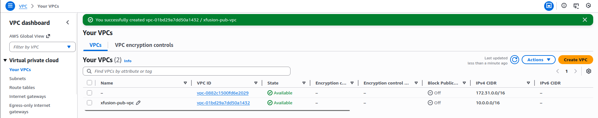
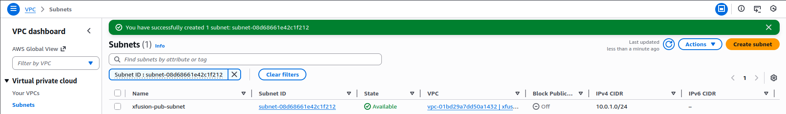
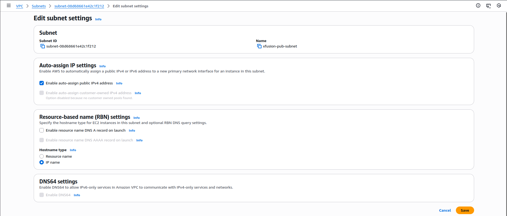
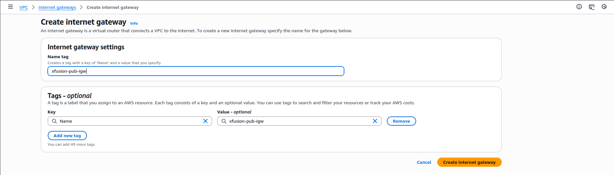
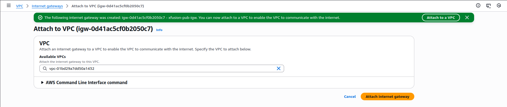
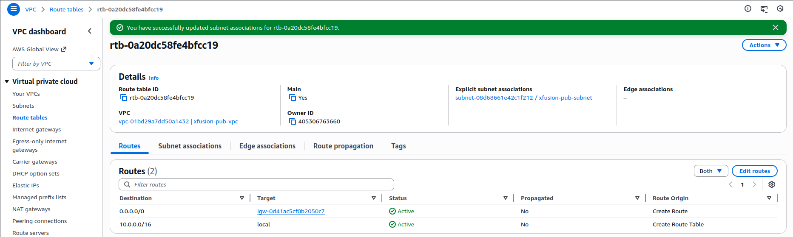

🔹 STEP 1: Create the Public VPC

Go to AWS Console → VPC

Click Create VPC

Select VPC only

Configure:

Name: xfusion-pub-vpc

IPv4 CIDR block: 10.0.0.0/16

Tenancy: Default

Click Create VPC

🔹 STEP 2: Create the Public Subnet

In VPC → Subnets

Click Create subnet

Configure:

VPC: xfusion-pub-vpc

Subnet name: xfusion-pub-subnet

Availability Zone: any (e.g., us-east-1a)

IPv4 CIDR: 10.0.1.0/24

Click Create subnet

🔹 STEP 3: Enable Auto-Assign Public IP on Subnet (VERY IMPORTANT)

Select xfusion-pub-subnet

Click Actions → Edit subnet settings

Enable:

✅ Auto-assign public IPv4 address

Click Save

This ensures all EC2 instances launched in this subnet get a public IP automatically.

🔹 STEP 4: Create & Attach Internet Gateway
4.1 Create Internet Gateway

VPC → Internet Gateways

Click Create internet gateway

Name: xfusion-pub-igw

Click Create

4.2 Attach Internet Gateway to VPC

Select xfusion-pub-igw

Click Actions → Attach to VPC

Select xfusion-pub-vpc

Click Attach

🔹 STEP 5: Configure Route Table for Internet Access

Go to VPC → Route Tables

Select the route table associated with xfusion-pub-vpc

Click Edit routes

Add route:

Destination: 0.0.0.0/0

Target: Internet Gateway (xfusion-pub-igw)

Save changes

Associate Route Table with Subnet

Go to Subnet associations

Click Edit subnet associations

Select xfusion-pub-subnet

Save

🔹 STEP 6: Launch EC2 Instance in Public VPC

Go to EC2 → Launch instance

Configure:

Instance details

Name: xfusion-pub-ec2

AMI: Amazon Linux or Ubuntu

Instance type: t2.micro

Network settings

VPC: xfusion-pub-vpc

Subnet: xfusion-pub-subnet

Auto-assign public IP: Enabled

Security Group (IMPORTANT)

Create a new security group:

Name: xfusion-pub-sg

Inbound rules:

Type	Port	Source
SSH	22	0.0.0.0/0

Outbound: Allow all

Launch the instance

🔹 STEP 7: Verify Internet & SSH Access

Wait for:

Instance state: Running

Status checks: 2/2 passed

Select xfusion-pub-ec2

Confirm:

Public IPv4 address exists

---