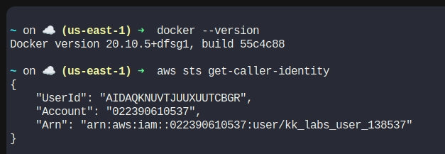
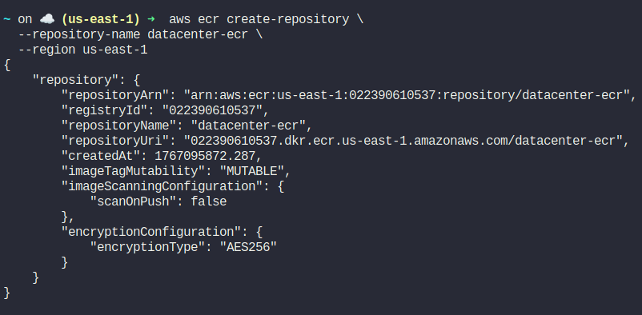
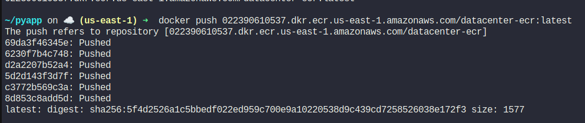
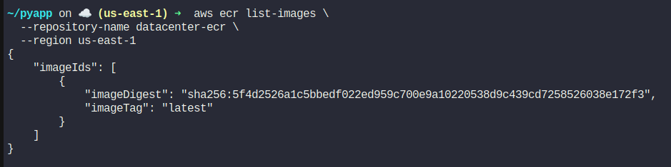

🔹 STEP 1: Verify Docker & AWS CLI

On aws-client, confirm Docker is running:

```
docker --version
```

Confirm AWS CLI is configured:

aws sts get-caller-identity




🔹 STEP 2: Create the ECR Repository

Run:
```
aws ecr create-repository \
  --repository-name datacenter-ecr \
  --region us-east-1
```

You will get output containing:

"repositoryUri": "123456789012.dkr.ecr.us-east-1.amazonaws.com/datacenter-ecr"


📌 Copy the repositoryUri — you’ll need it.



🔹 STEP 3: Authenticate Docker to ECR

Run:
```
aws ecr get-login-password --region us-east-1 \
| docker login --username AWS --password-stdin \
022390610537.dkr.ecr.us-east-1.amazonaws.com/datacenter-ecr
```

✅ Expected output:

Login Succeeded

🔹 STEP 4: Build the Docker Image

Navigate to the directory with the Dockerfile:

```
cd /root/pyapp

# Build the image:

docker build -t datacenter-ecr:latest .

# Verify the image exists:

docker images


You should see:

datacenter-ecr   latest   <image-id>


🔹 STEP 5: Tag the Image for ECR

Tag the image using the repository URI:
```
docker tag datacenter-ecr:latest \
022390610537.dkr.ecr.us-east-1.amazonaws.com/datacenter-ecr:latest
```

🔹 STEP 6: Push the Image to ECR

Run:

```
docker push 022390610537.dkr.ecr.us-east-1.amazonaws.com/datacenter-ecr:latest
```

✅ You should see layer upload progress and a successful push.



🔹 STEP 7: Verify Image in ECR

Run:
```
aws ecr list-images \
  --repository-name datacenter-ecr \
  --region us-east-1
```



---