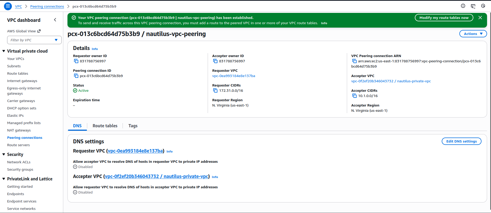
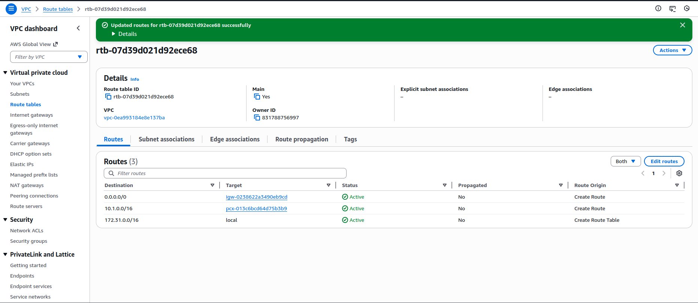
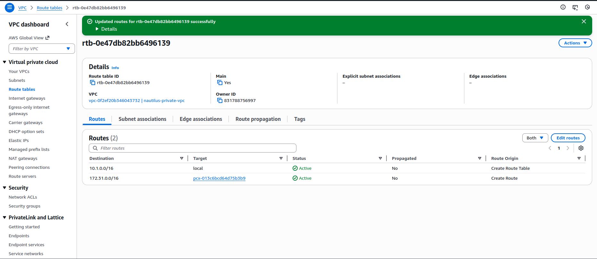
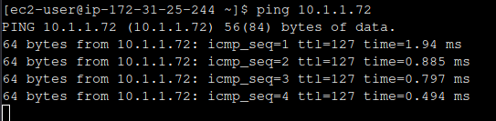

Step-by-Step
1) Create and accept the VPC Peering connection

VPC → Peering connections → Create peering connection

Configure:

Name: nautilus-vpc-peering

Requester VPC: Default VPC

Accepter VPC: nautilus-private-vpc

Region: same region

Create, then Accept the request.

Status should be Active.



2) Configure Route Tables (CRITICAL)
2.1 Default VPC route table

VPC → Route Tables

Select the main route table for the Default VPC

Edit routes → Add route

Destination: 10.1.0.0/16

Target: nautilus-vpc-peering

Save.



2.2 Private VPC route table

Select the route table associated with nautilus-private-subnet

Edit routes → Add route

Destination: 172.31.0.0/16 (Default VPC CIDR)

Target: nautilus-vpc-peering

Save.

✔ Both sides must have routes to each other’s CIDR via the peering connection.



3) Update Security Groups
3.1 Public EC2 security group

Ensure inbound allows SSH:

SSH (22) from 0.0.0.0/0 (or your IP)

3.2 Private EC2 security group (to allow ping)

Add inbound rule:

ICMP – Echo Request

Source: 172.31.0.0/16 (Default VPC CIDR)

✔ This allows the public EC2 to ping the private EC2.

4) Add your SSH key to the public EC2

On aws-client, display your public key:
```
cat /root/.ssh/id_rsa.pub

# Connect to the public EC2 (via console/EC2 Instance Connect or existing access), then:

mkdir -p ~/.ssh
vi ~/.ssh/authorized_keys

Paste the public key, save, then fix permissions:

chmod 700 ~/.ssh
chmod 600 ~/.ssh/authorized_keys
```

5) SSH to the public EC2 from aws-client
```
ssh -i /root/.ssh/id_rsa ec2-user@<PUBLIC_EC2_PUBLIC_IP>
```

Login should succeed.

6) Test connectivity: ping the private EC2

From inside nautilus-public-ec2, ping the private IP of nautilus-private-ec2 (example):

ping 10.1.1.x


Expected: replies received (ICMP works).



---