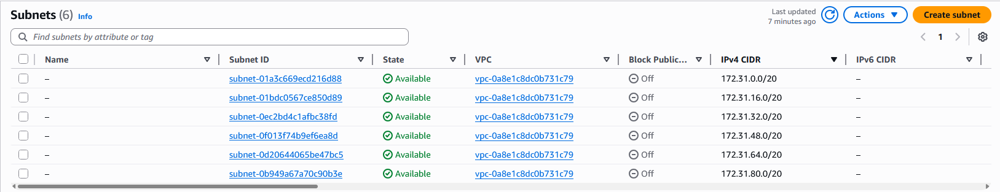
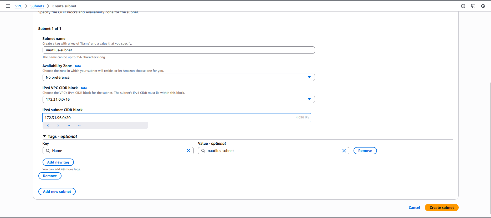
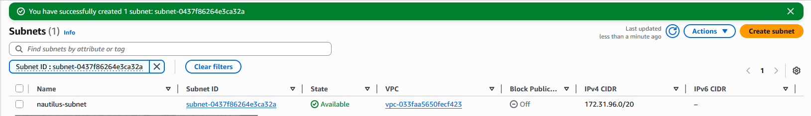

### Steps to Create the Subnet (AWS Console)
1. Log in to AWS Console

Use your provided username/password.
Make sure the region is us-east-1 (N. Virginia).

2. Find the Default VPC

Go to VPC service → Your VPCs.

Look for the VPC where:

Name tag = blank or "default"

Is Default = Yes

Copy the VPC ID (e.g., vpc-0abc1234def567890).

3. Create the Subnet

In the left menu → click Subnets.

Click Create subnet.

Fill in:

VPC ID: (select your default VPC)

Subnet name: nautilus-subnet

Availability Zone: pick any (e.g., us-east-1a)

IPv4 CIDR block: choose a free block, e.g.:

172.31.96.0/20

(Default VPC ranges usually use 172.31.0.0/16; any unused /24 inside that is fine.)

Click Create subnet.

---
