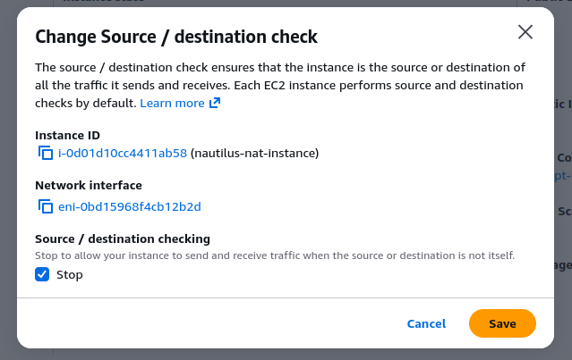
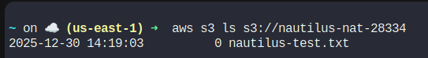

🔹 STEP 1: Create a Public Subnet

Go to VPC → Subnets → Create subnet

Configure:

VPC: nautilus-priv-vpc

Subnet name: nautilus-pub-subnet

AZ: same region (any AZ)

CIDR: e.g. 10.1.2.0/24 (must NOT overlap)

Create subnet


Enable public IP auto-assign

Select nautilus-pub-subnet

Actions → Edit subnet settings

Enable:

✅ Auto-assign public IPv4 address

Save


🔹 STEP 2: Ensure Internet Gateway Exists

Go to VPC → Internet Gateways

If none exists:

Create one (e.g. nautilus-igw)

Attach it to nautilus-priv-vpc

🔹 STEP 3: Create Route Table for Public Subnet

Go to VPC → Route Tables → Create route table

Configure:

Name: nautilus-pub-rt

VPC: nautilus-priv-vpc

Create

Add route to Internet

Edit routes → Add:

Destination: 0.0.0.0/0

Target: Internet Gateway

Associate with public subnet

Subnet associations → Edit

Select nautilus-pub-subnet

Save

🔹 STEP 4: Create Security Group for NAT Instance

EC2 → Security Groups → Create

Configure:

Name: nautilus-nat-sg

VPC: nautilus-priv-vpc

Inbound rules
Type	Source
All traffic	Private subnet CIDR (e.g. 10.1.0.0/16)

SSH to All traffic

Create SG.

🔹 STEP 5: Launch NAT Instance

EC2 → Launch instance

Configure:

Basic

Name: nautilus-nat-instance

AMI: Amazon Linux 2

Instance type: t2.micro

Network

VPC: nautilus-priv-vpc

Subnet: nautilus-pub-subnet

Auto-assign public IP: Enabled

Security group: nautilus-nat-sg

Launch instance
🔹 STEP 6: Disable Source/Destination Check (CRITICAL)

Select nautilus-nat-instance

Actions → Networking → Change source/destination check

Disable it

Save

⚠️ If you skip this step, NAT will not work



🔹 STEP 7: Enable IP Forwarding on NAT Instance

Connect to the NAT instance (via SSH or EC2 Instance Connect):

```
sudo sysctl -w net.ipv4.ip_forward=1

#Make it persistent:

echo "net.ipv4.ip_forward = 1" | sudo tee -a /etc/sysctl.conf

sudo iptables -t nat -A POSTROUTING -o eth0 -j MASQUERADE
sudo yum install -y iptables-services
sudo service iptables save
sudo systemctl enable iptables
sudo systemctl start iptables
sudo systemctl status iptables

```

🔹 STEP 8: Update Private Subnet Route Table

Go to VPC → Route Tables

Select the route table associated with nautilus-priv-subnet

Edit routes → Add:

Destination	Target
0.0.0.0/0	nautilus-nat-instance (instance ID)

Save.

🧪 VERIFICATION (FINAL & IMPORTANT)
Wait 1–2 minutes (cron runs every minute)

Then check S3:
```
aws s3 ls s3://nautilus-nat-28334
```




---