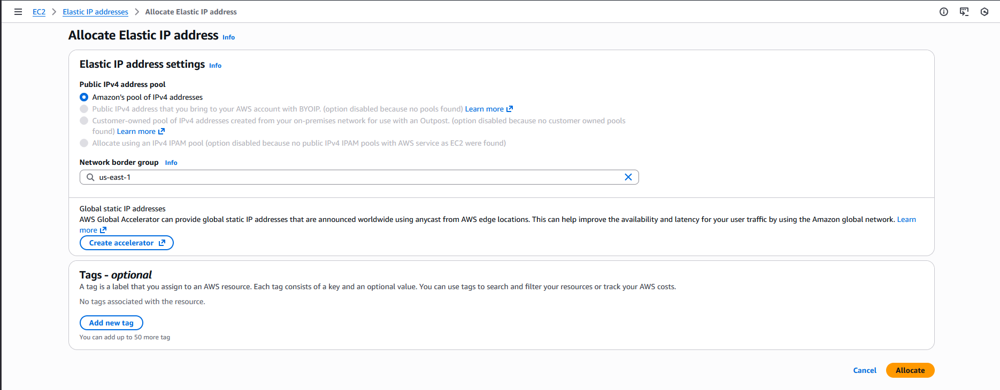
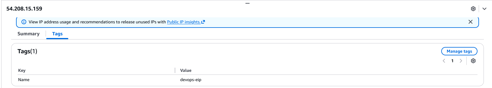

###  Steps to Allocate and Name an Elastic IP

1. Log in to AWS Console

Use the console URL provided and the username/password (do not share these again).

Ensure region = us-east-1 (N. Virginia).

2. Navigate to Elastic IPs

Search for EC2 in the AWS console.

In the left EC2 menu, scroll to the “Network & Security” section.

Click Elastic IPs.

3. Allocate a New Elastic IP

Click Allocate Elastic IP address.

Leave settings as default:

Amazon’s pool of IPv4 addresses (default)

Click Allocate.

The system will display the newly allocated EIP.

4. Add a Name Tag

Select your new Elastic IP from the list.

At the bottom or top, click Tags.

Click Add/Edit tags.

Add:

Key: Name

Value: devops-eip

Save the changes.

---