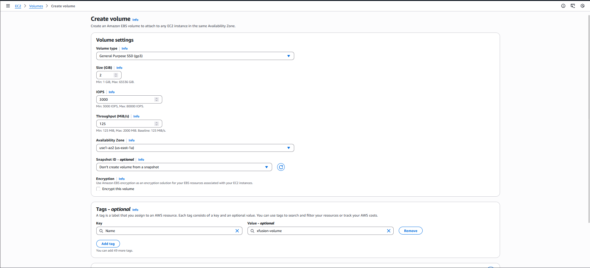

###  Step-by-Step Instructions (AWS Console)
1. Log in to AWS Console

Use your provided console link and credentials.
Ensure the region is us-east-1 (N. Virginia).

2. Navigate to the EBS Volumes Page

Search for EC2 in the AWS console.

In the left navigation pane, scroll to Elastic Block Store.

Click Volumes.

3. Create the Volume

Click Create volume.

Fill in the required fields:

Volume type: General Purpose SSD (gp3)

Size: 2 (GiB)

Availability Zone: choose any AZ (e.g., us-east-1a)
(Important: It must match the instance AZ later if you plan to attach it.)

Scroll to Tags:

Add tag

Key: Name

Value: xfusion-volume

Click Create volume.

---