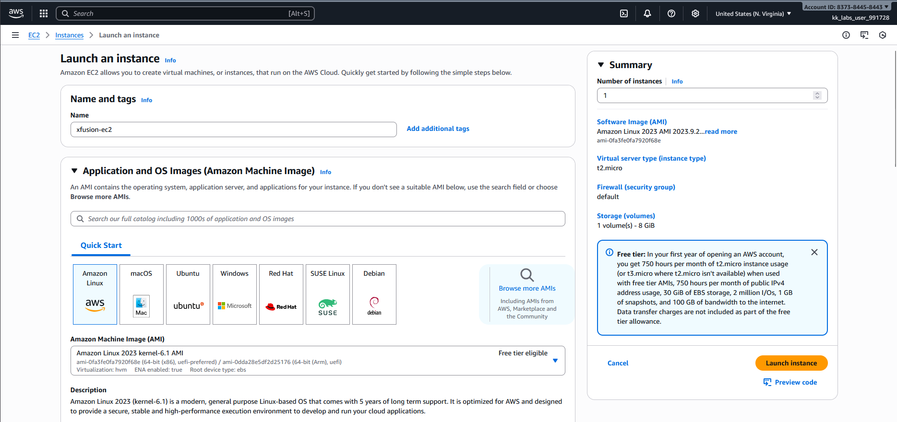
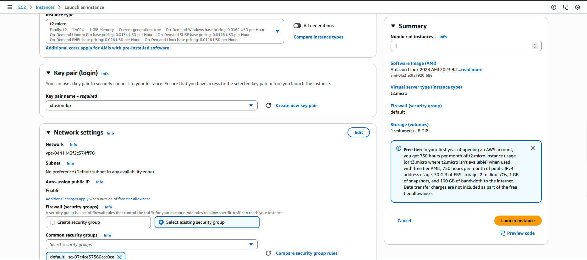
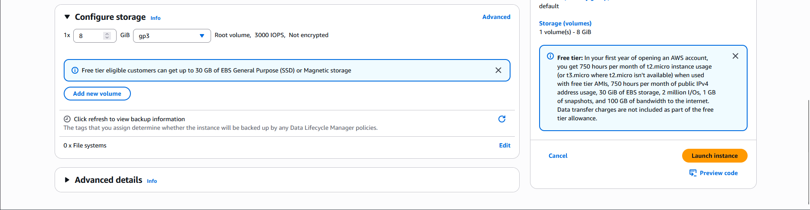

### Step-by-Step Instructions (AWS Console)

1. Log in

Use your console URL and credentials.
Ensure region = us-east-1 (N. Virginia).

2. Navigate to EC2

Search for EC2 service in the console.

3. Launch Instance

Click Launch instance.

4. Configure Instance Details
4.1 Name the instance

In the "Name and tags" section:

Name: xfusion-ec2

4.2 Choose Amazon Linux AMI

Under “Application and OS Images (Amazon Machine Image) (AMI)”:

Select:

Amazon Linux 2 AMI (HVM), SSD Volume Type
(or Amazon Linux 2023 if that’s what your lab provides — both satisfy "Amazon Linux AMI")

4.3 Select Instance Type

Choose:

t2.micro
(Eligible for free tier, commonly used in labs)

4.4 Create Key Pair

Under Key pair (login):

Click Create new key pair

Enter:

Name: xfusion-kp

Key pair type: RSA

Private key file format: .pem (recommended)

Click Create key pair
(A .pem file downloads automatically — save it securely.)

4.5 Security Group

Under Network settings:

Choose Select existing security group

Select the default security group for the default VPC
(It will typically be named “default”)

No changes needed.

5. Launch

Scroll down and click Launch instance.

---