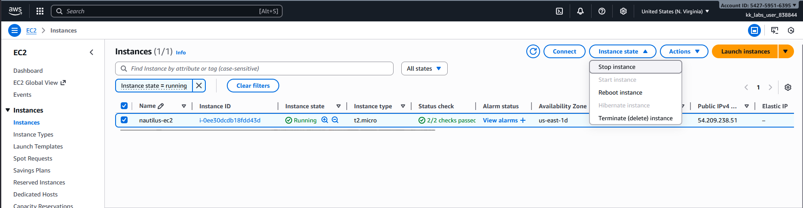
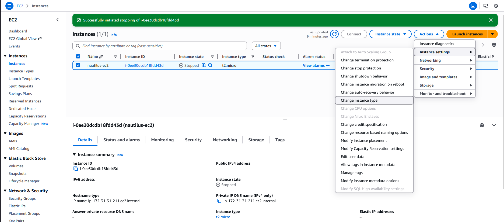
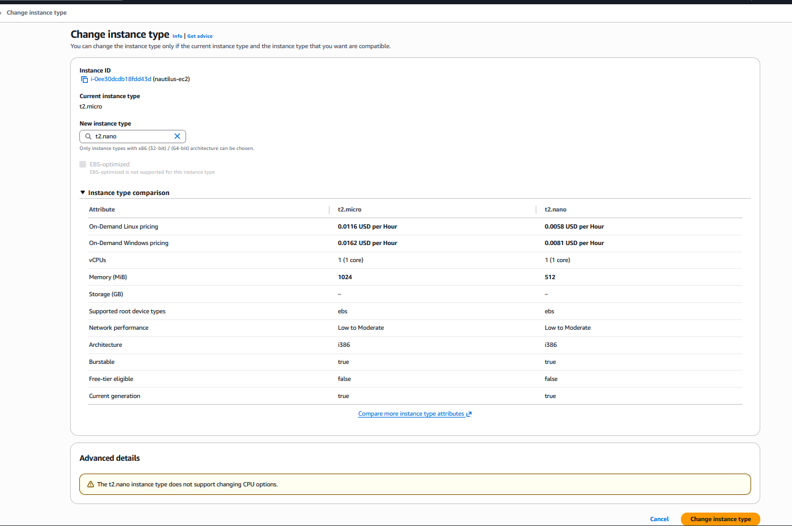
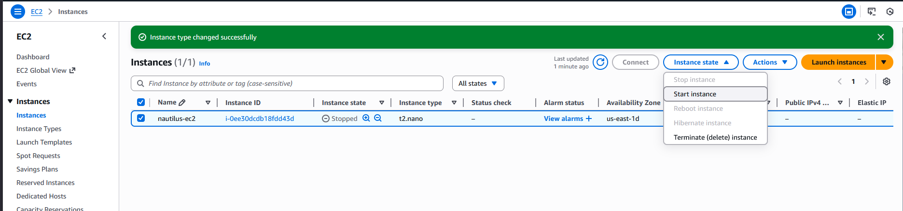

### Step-by-Step Instructions (AWS Console)
1. Log in to the AWS Console

Use your provided console URL and credentials.
Make sure region = us-east-1.

2. Open the EC2 Page

Search EC2 in the AWS services search bar.

3. Locate the Instance

In the left navigation menu:

Click Instances

Find the instance named nautilus-ec2

Verify:

Instance state: must be running

Status checks: should show 2/2 checks passed
If it still says Initializing, wait until it passes.

4. Stop the Instance

EC2 instance type cannot be changed while running (for EBS-backed instances).

Select nautilus-ec2

Click Instance state → Stop instance

Confirm "Stop"

Wait until the status changes to stopped.

5. Change the Instance Type

Once the instance is stopped:

Select the instance

Click Actions → Instance settings → Modify instance type

Choose:

Instance type: t2.nano

Click Apply or Save

6. Start the Instance

Select the instance

Click Instance state → Start instance

Wait until:

State: Running

Status checks: Pass 2/2

---