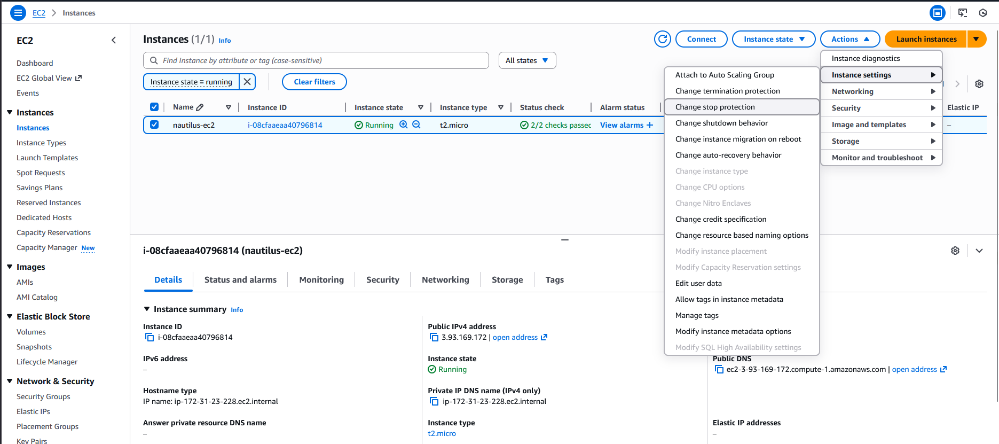
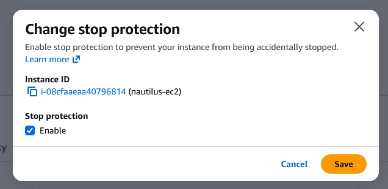

###  Step-by-Step Instructions (AWS Console)

1. Log in to AWS Console

Use your provided console URL and credentials.
Confirm the region is us-east-1.

2. Navigate to EC2

Go to EC2 service

3. Locate the Instance

In the left menu → click Instances

Find instance named nautilus-ec2

Select the checkbox next to it

4. Enable Stop Protection

With the instance selected:

Click Actions

Go to Instance settings

Click Change termination protection or Edit stop protection

A panel opens — look for:

Enable stop protection (or “Disable API stop”)

Check the box to enable stop protection

Click Save

---