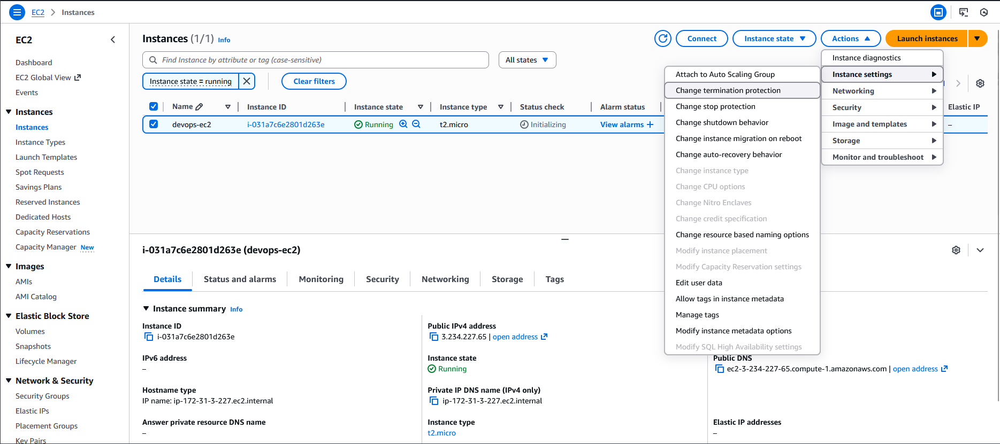
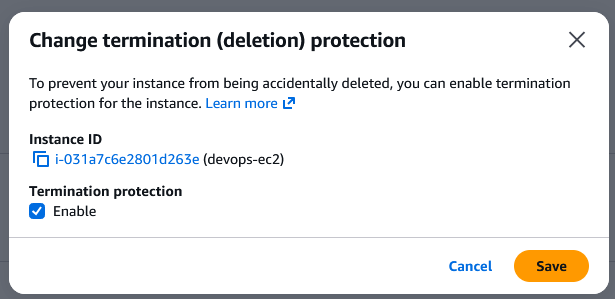

### Step-by-Step Instructions (AWS Console)
1. Log in to AWS Console

Use the console URL and credentials you were given.
Ensure the region is us-east-1 (N. Virginia).

2. Navigate to EC2

Open the EC2 service from the AWS console search bar.

3. Find the Instance

Click Instances in the left panel.

Locate devops-ec2.

Select it.

4. Enable Termination Protection

With the instance selected:

Click Actions

Choose Instance settings

Click Change termination protection
(Sometimes shown as Edit termination protection)

A settings panel will appear.

Check the box Enable termination protection

Click Save

---