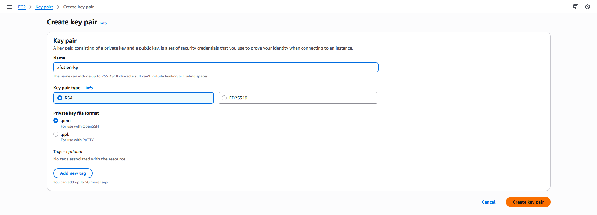
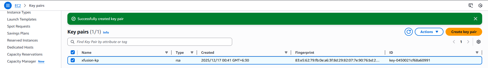

#### Step-by-Step Solution (AWS Management Console)

Step 1: Log in to AWS Console

Open a web browser.

Log in to the AWS Management Console using the lab-provided credentials.

Step 2: Open the EC2 Service

In the AWS Console search bar, type EC2.

Click on EC2 to open the EC2 Dashboard.

Step 3: Navigate to Key Pairs

From the left navigation panel, scroll to Network & Security.

Click on Key Pairs.

Step 4: Create a New Key Pair

Click Create key pair.

Configure the following settings:

Name: xfusion-kp

Key pair type: RSA

Private key file format: .pem (leave default unless specified)

Step 5: Create and Download the Key Pair

Click Create key pair.

The file xfusion-kp.pem will be downloaded automatically.

Save the file securely — it cannot be downloaded again.

Step 6: Verification

Ensure the key pair xfusion-kp is listed under Key Pairs.

Confirm the Type is RSA.

---